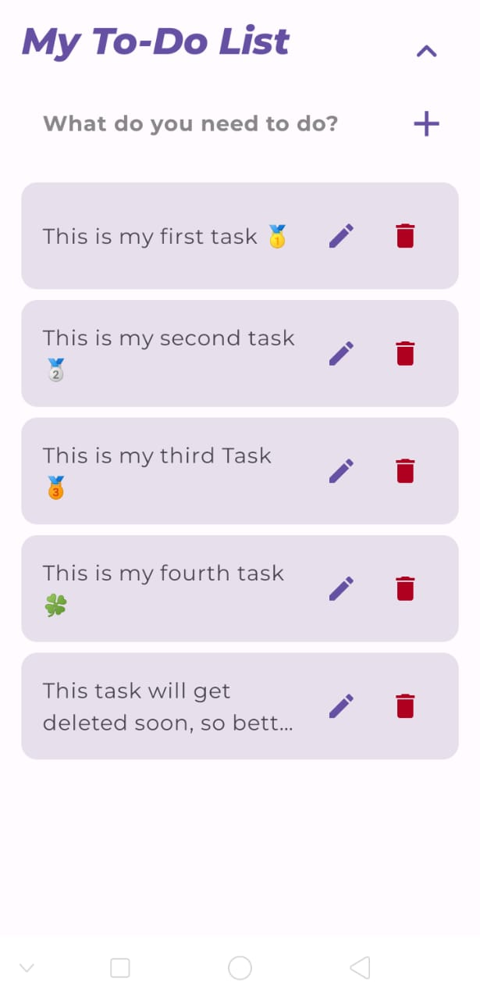

# Todo App

A simple and elegant Todo application built using Jetpack Compose and Material3 API for Android. This app allows users to add, remove, and update tasks seamlessly while ensuring data persistence on the device, so you never lose your tasks when the app closes.

## Features

- **Add Tasks**: Easily add new tasks to your to-do list.
- **Remove Tasks**: Remove tasks you no longer need.
- **Update Tasks**: Modify existing tasks with ease.
- **Data Persistence**: All tasks are stored locally on the device, ensuring your data is safe even when the app is closed.
- **Cool UI**: A modern and user-friendly interface built with Jetpack Compose and Material3 for a better user experience.

## Tech Stack

- **Android**: The app is built for Android using Kotlin.
- **Jetpack Compose**: Utilizes Jetpack Compose for UI development.
- **Material3**: Implements Material3 components for a contemporary design.
- **Local Storage**: Uses local storage to persist user data.

## Screenshots
<table>
  <tr>
    <td align="center">
      
      <p><em>Main Screen</em></p>
    </td>
    <td align="center">
      
      <p><em>View Task</em></p>
    </td>
    <td align="center">
      
      <p><em>Update Task</em></p>
    </td>
    <td align="center">
      
      <p><em>Delete Task</em></p>
    </td>
    <td align="center">
      
      <p><em>Sort Task</em></p>
    </td>
  </tr>
</table>

### Clone the Repository

```bash
git clone https://github.com/yourusername/todo-app.git
cd todo-app
```

### Open the Project

1. Open Android Studio.
2. Click on `File` > `Open` and select the cloned project directory.
3. Wait for the project to sync.

### Run the App

1. Connect your Android device or start an emulator.
2. Click on the `Run` button in Android Studio.

## Usage

1. Launch the app on your device.
2. Use the input field to add a new task.
3. Click the add button to save the task.
4. To update a task, click on the task in the list, modify the text, and confirm the update.
5. To remove a task, click on the delete icon next to the task.

## Contributing

Contributions are welcome! If you would like to contribute, please fork the repository and submit a pull request with your changes.

## Contact

For questions or feedback, feel free to reach out to me via:

- **Email**: sandygupta695@gmail.com
- **GitHub**: [Shayar-Gupta](https://github.com/Shayar-Gupta)
